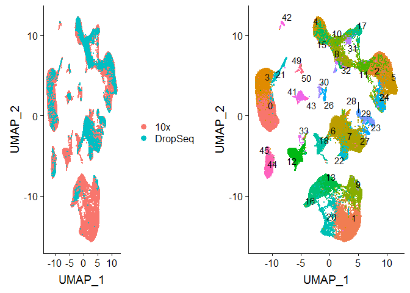

This script is for loading the scRNAseq data from Vento-tormo et al. 2018 Nature into seurat and
performing CCA, PCA, and UMAP coordinates.

At the end of this script, an R object containing combined 10x and drop-seq data is created, along with CCA, PCA, and UMAP coordinates for downstream analysis. Meta data is also available, taken from the public repository only --- some sample info is present in the supplementary table 2 which has not
yet been added to the R object.

# 1.0 Libraries 


```r
library(readxl) # read data in
library(plyr) 
library(stringr)
library(knitr);library(kableExtra) # for displaying pretty tables
library(dplyr)
library(Seurat) # V3
library(readr)
library(ggplot2)
library(cowplot)
library(tidyr)
```

# 2.0 Load Data

Set a directory where scRNAseq files are located


```r
base_dir <- '../../data/Roser Vento-Tormo/'
```

First I load in the 10x data, make sure everything is OK and matching between data types (count, meta). Then I fix / remove errors or uninformative columns. Then I repeat with the drop seq data.

Note that the meta data for these datasets is stored in two tables, one I refer to as 'sdrf' after
the file name. It's necessary to combine both meta dataframes since they contain different pieces of
information.

## 10x data


```r
#10x data
system.time(
  raw_10x <- read_tsv(paste0(base_dir, '10x/E-MTAB-6701.processed.1/raw_data_10x.txt'))
) #  20 min
```

```
## Parsed with column specification:
## cols(
##   .default = col_double(),
##   Gene = col_character()
## )
```

```
## See spec(...) for full column specifications.
```

```
##    user  system elapsed 
##  808.58   40.12  857.78
```

```r
dim(raw_10x) # 31764 transcripts 64735-1 cells (minus one for gene name column)
```

```
## [1] 31764 64735
```

```r
# read in meta data, stored in two tables
meta_10x_clusters <- read_tsv(paste0(base_dir, '10x/E-MTAB-6701.processed.2/E-MTAB-6701_arrayexpress_10x_meta.txt')) %>%
  select(-X1) %>%
  mutate(platform = '10x', Cell_ID = Cell) %>% # this is RUN_ID pasted to UMI barcode
  separate(Cell, into = c('Source_Name', 'UMI_ID'))
```

```
## Warning: Missing column names filled in: 'X1' [1]
```

```
## Parsed with column specification:
## cols(
##   X1 = col_double(),
##   final_cluster = col_double(),
##   Cell = col_character(),
##   Fetus = col_character(),
##   location = col_character(),
##   annotation = col_character()
## )
```

```r
# this has more sample-specific info, like patient ID, GA range and facs enrichment
meta_10x_sdrf <- read_delim(paste0(base_dir,
                                   '10x/E-MTAB-6701.sdrf.txt'), delim = '\t') %>% 
  select(-contains('Factor Value')) # duplicate columns
```

```
## Warning: Duplicated column names deduplicated: 'Protocol REF' => 'Protocol
## REF_1' [20], 'Protocol REF' => 'Protocol REF_2' [21], 'Protocol REF' =>
## 'Protocol REF_3' [30], 'Comment[FASTQ_URI]' => 'Comment[FASTQ_URI]_1' [39],
## 'Comment[FASTQ_URI]' => 'Comment[FASTQ_URI]_2' [40], 'Protocol REF' =>
## 'Protocol REF_4' [43], 'Protocol REF' => 'Protocol REF_5' [46], 'Derived
## Array Data File' => 'Derived Array Data File_1' [47], 'Comment [Derived
## ArrayExpress FTP file]' => 'Comment [Derived ArrayExpress FTP file]_1' [48]
```

```
## Parsed with column specification:
## cols(
##   .default = col_character(),
##   `Comment[NOMINAL_LENGTH]` = col_double(),
##   `Comment[NOMINAL_SDEV]` = col_double(),
##   `Comment[SPOT_LENGTH]` = col_double(),
##   `Comment[READ_INDEX_1_BASE_COORD]` = col_double(),
##   `Comment[umi barcode offset]` = col_double(),
##   `Comment[umi barcode size]` = col_double(),
##   `Comment[cell barcode offset]` = col_double(),
##   `Comment[cell barcode size]` = col_double(),
##   `Comment[cDNA read offset]` = col_double(),
##   `Comment[cDNA read size]` = col_double(),
##   `Comment[sample barcode offset]` = col_double(),
##   `Comment[sample barcode size]` = col_double()
## )
## See spec(...) for full column specifications.
```

```r
# tidy column names
colnames(meta_10x_sdrf) <- 
  gsub('\\s', '\\_', gsub('^.*\\[', '', gsub('\\]', '', colnames(meta_10x_sdrf))))

# remove unimportant columns
meta_10x_sdrf <- meta_10x_sdrf %>% 
  select(-c(organism, developmental_stage, library_construction:index1_file))

# conbine meta_10x_sdrf and meta_10x into one data frame
all(meta_10x_clusters$Source_Name %in% meta_10x_sdrf$Source_Name) #T
```

```
## [1] TRUE
```

```r
all(meta_10x_sdrf$Source_Name %in% meta_10x_clusters$Source_Name) #F
```

```
## [1] FALSE
```

```r
missing <- meta_10x_sdrf %>% 
  filter(!Source_Name %in% meta_10x_clusters$Source_Name) 
missing
```

```
## # A tibble: 6 x 11
##   Source_Name ENA_SAMPLE BioSD_SAMPLE individual sex   organism_part
##   <chr>       <chr>      <chr>        <chr>      <chr> <chr>        
## 1 FCA7167220  ERS2657609 SAMEA4837742 D6         fema~ decidua      
## 2 FCA7474066  ERS2657633 SAMEA4837766 D10        fema~ placenta     
## 3 FCA7474069  ERS2657636 SAMEA4837769 D11        fema~ placenta     
## 4 FCA7511883  ERS2657639 SAMEA4837772 D12        fema~ decidua      
## 5 FCA7511885  ERS2657641 SAMEA4837774 D12        fema~ placenta     
## 6 FCA7511886  ERS2657642 SAMEA4837775 D12        fema~ placenta     
## # ... with 5 more variables: disease <chr>, clinical_information <chr>,
## #   FACS_marker <chr>, run <chr>, single_cell_isolation <chr>
```

"FCA7167220" "FCA7474066" "FCA7474069" "FCA7511883" "FCA7511885" "FCA7511886" 
samples are not in the count matrix, or meta data matrix. Not clear exactly why, but these have special enrichment so perhaps these samples yielded no cells? --update these are the EPCAM+ and 
HLA-G+ cells. Unfortunately not sure why they are not included in the dataset. Or perhaps I'm 
missing them...


```r
# merge meta data
meta_10x <- left_join(meta_10x_clusters, meta_10x_sdrf, by = 'Source_Name') %>%
  select(-organism_part, -run) # remove duplicate columns
head(colnames(raw_10x))
```

```
## [1] "Gene"                        "FCA7167222_TCTGGAACAGAGTGTG"
## [3] "FCA7167226_GGAACTTGTCTAAACC" "FCA7196225_ACTATCTCATTCACTT"
## [5] "FCA7474063_AAAGCAAGTCAAACTC" "FCA7196219_CTCGAAAGTTAAGTAG"
```

## drop seq

dropseq data is in same structure as 10x:
- count data matrix
- meta data table 1
- meta data table 2

So again we merge the two meta data tables as we did above for the 10x data.


```r
# Drop seq count data
system.time(
  raw_ds <- read_tsv(paste0(base_dir, 'DropSeq/raw_data_ss2.txt'))
) #  20 min
```

```
## Parsed with column specification:
## cols(
##   .default = col_double(),
##   Gene = col_character()
## )
```

```
## See spec(...) for full column specifications.
```

```
##    user  system elapsed 
##   34.11    6.87   42.10
```

```r
#meta data tables 1 and 2
meta_ds_clusters <- read_tsv(paste0(base_dir, 
                                    'DropSeq/E-MTAB-6678_arrayexpress_ss2_meta.txt')) %>%
  select(-X1) %>%
  mutate(platform = 'DropSeq')
```

```
## Warning: Missing column names filled in: 'X1' [1]
```

```
## Parsed with column specification:
## cols(
##   X1 = col_double(),
##   final_cluster = col_double(),
##   Cell = col_character(),
##   Fetus = col_character(),
##   location = col_character(),
##   annotation = col_character()
## )
```

```r
meta_ds_sdrf <- read_delim(paste0(base_dir,
                                   'DropSeq/E-MTAB-6678.sdrf.txt'), delim = '\t')
```

```
## Warning: Duplicated column names deduplicated: 'Protocol REF' => 'Protocol
## REF_1' [17], 'Protocol REF' => 'Protocol REF_2' [18], 'Protocol REF' =>
## 'Protocol REF_3' [33], 'Protocol REF' => 'Protocol REF_4' [44], 'Protocol
## REF' => 'Protocol REF_5' [47], 'Derived Array Data File' => 'Derived Array
## Data File_1' [48], 'Comment [Derived ArrayExpress FTP file]' => 'Comment
## [Derived ArrayExpress FTP file]_1' [49]
```

```
## Parsed with column specification:
## cols(
##   .default = col_character(),
##   `Comment[NOMINAL_LENGTH]` = col_double(),
##   `Comment[NOMINAL_SDEV]` = col_double(),
##   `Comment[SPOT_LENGTH]` = col_double(),
##   `Comment[READ_INDEX_1_BASE_COORD]` = col_double()
## )
## See spec(...) for full column specifications.
```

```r
# tidy column names
colnames(meta_ds_sdrf) <- 
  gsub('\\s', '\\_', gsub('^.*\\[', '', gsub('\\]', '', colnames(meta_ds_sdrf))))

#remove unimportant columns
meta_ds_sdrf <- meta_ds_sdrf %>% 
  select(-c(organism, organism_part, developmental_stage, Material_Type:single_cell_identifier))

# fix cell names, there is a type, the hashtag should be an underscore (or vice versa)
colnames(raw_ds) <- gsub('\\#', '_', colnames(raw_ds))
meta_ds_clusters <- meta_ds_clusters %>% 
  mutate(Cell = gsub('\\#', '_', Cell)) 
all(meta_ds_clusters$Cell == colnames(raw_ds)[2:ncol(raw_ds)]) #2
```

```
## [1] TRUE
```

There should be 5591 rows (cells), but the sdrf has 15194.


```r
table(meta_ds_sdrf$single_cell_quality) # it's not this
```

```
## 
##           OK OK, filtered 
##        11180         4014
```

```r
sum(meta_ds_sdrf$Source_Name %in% meta_ds_clusters$Cell) # 7597
```

```
## [1] 11180
```

```r
sum(unique(meta_ds_sdrf$Source_Name) %in% meta_ds_clusters$Cell) #5590, that's it
```

```
## [1] 5590
```

So looks like that are several rows with the same cell ID. Let's pull out a couple and see what's going on....

Update, I checked the columns that I previously filtered out, and it looks like the multiple rows 
per cell contain multiple fastq files. (e.g. row 1 of cell A is fasq file 1, and row 2 of cell A is fasq file 2).

This is an easy fix, just remove all duplicated entries, such that each unique cell ID is on a 
single row.


```r
# remove duplicate rows from sdrf file
meta_ds_sdrf <- meta_ds_sdrf %>% distinct # such a useful function omg
nrow(meta_ds_sdrf) # 15194 -> 7597 rows
```

```
## [1] 7597
```

```r
# merge
meta_ds <- left_join(meta_ds_clusters, meta_ds_sdrf, by = c('Cell' = 'Source_Name')) %>%
  rename(Cell_ID = Cell)
meta_ds
```

```
## # A tibble: 5,591 x 16
##    final_cluster Cell_ID Fetus location annotation platform ENA_SAMPLE
##            <dbl> <chr>   <chr> <chr>    <chr>      <chr>    <chr>     
##  1             0 24087_~ F13   Decidua  dS1        DropSeq  ERS2332207
##  2             0 23728_~ F10   Decidua  dS1        DropSeq  ERS2331637
##  3             0 24087_~ F13   Decidua  dS1        DropSeq  ERS2335036
##  4             0 23728_~ F10   Decidua  dS1        DropSeq  ERS2332714
##  5             0 24087_~ F13   Decidua  dS1        DropSeq  ERS2328494
##  6             0 24088_~ F10   Decidua  dS1        DropSeq  ERS2328250
##  7             0 23728_~ F10   Decidua  dS1        DropSeq  ERS2329158
##  8             0 23728_~ F10   Decidua  dS1        DropSeq  ERS2334811
##  9             0 24088_~ F10   Decidua  dS1        DropSeq  ERS2328157
## 10             0 23728_~ F10   Decidua  dS1        DropSeq  ERS2328068
## # ... with 5,581 more rows, and 9 more variables: BioSD_SAMPLE <chr>,
## #   individual <chr>, sex <chr>, disease <chr>,
## #   clinical_information <chr>, cell_gating <chr>,
## #   inferred_cell_type <chr>, submitted_annotation <chr>,
## #   single_cell_quality <chr>
```

5591 rows, or cells, exactly matching the number of cells in the count matrix

## 2.1 Merge data

Before merging, need to make the column names the same across drop seq and 10x meta data.

Some columns will be present in one and not the other. These columns we keep, and put in NAs for the
other dataset when combined. Example of these columns: 

- run (10x-specific)
- FACS_marker (10x-specific)
- cell_gating (ds-specific)
- single_cell_quality (ds-specific)


```r
#check order and column names match
all(colnames(raw_10x)[2:ncol(raw_10x)] == meta_10x$Cell_ID) # T
```

```
## [1] TRUE
```

```r
all(colnames(raw_ds)[2:ncol(raw_ds)] == meta_ds$Cell_ID) # T
```

```
## [1] TRUE
```

```r
all(colnames(meta_10x) == colnames(meta_ds)) # F
```

```
## [1] FALSE
```

```r
# rename columns such that they match if they are the same
meta_10x <- meta_10x %>% 
  rename(Run = Source_Name) %>% 
  select(-single_cell_isolation)
# remaining columns that are unique to each meta data frame can be kept

# merge meta
meta <- bind_rows(meta_10x, meta_ds) %>%
  
  #reorganize column order
  select(-platform, -ENA_SAMPLE, -BioSD_SAMPLE, # move these to the back
         platform, ENA_SAMPLE, BioSD_SAMPLE)
meta # 70325 cells
```

```
## # A tibble: 70,325 x 19
##    final_cluster Run   UMI_ID Fetus location annotation Cell_ID individual
##            <dbl> <chr> <chr>  <chr> <chr>    <chr>      <chr>   <chr>     
##  1             0 FCA7~ TCTGG~ F20   Decidua  dS1        FCA716~ D7        
##  2             0 FCA7~ GGAAC~ F20   Decidua  dS1        FCA716~ D7        
##  3             0 FCA7~ ACTAT~ F27   Decidua  dS1        FCA719~ D9        
##  4             0 FCA7~ AAAGC~ F36   Decidua  dS1        FCA747~ D10       
##  5             0 FCA7~ CTCGA~ F25   Decidua  dS1        FCA719~ D8        
##  6             0 FCA7~ ACACC~ F40   Decidua  dS1        FCA751~ D12       
##  7             0 FCA7~ AGACG~ F20   Decidua  dS1        FCA716~ D7        
##  8             0 FCA7~ ACTAT~ F20   Decidua  dS1        FCA716~ D7        
##  9             0 FCA7~ GCGCG~ F20   Decidua  dS1        FCA716~ D7        
## 10             0 FCA7~ CACCA~ F20   Decidua  dS1        FCA716~ D7        
## # ... with 70,315 more rows, and 11 more variables: sex <chr>,
## #   disease <chr>, clinical_information <chr>, FACS_marker <chr>,
## #   cell_gating <chr>, inferred_cell_type <chr>,
## #   submitted_annotation <chr>, single_cell_quality <chr>, platform <chr>,
## #   ENA_SAMPLE <chr>, BioSD_SAMPLE <chr>
```

```r
#merge count data
all(raw_10x$Gene == raw_ds$Gene) # T
```

```
## [1] TRUE
```

```r
raw <- raw_10x %>% full_join(raw_ds, by = 'Gene')

#check that merged count matrix matches meta cell IDs
all(colnames(raw)[2:ncol(raw)] == meta$Cell_ID) # T
```

```
## [1] TRUE
```

```r
raw[1:6,1:6]
```

```
## # A tibble: 6 x 6
##   Gene  FCA7167222_TCTG~ FCA7167226_GGAA~ FCA7196225_ACTA~ FCA7474063_AAAG~
##   <chr>            <dbl>            <dbl>            <dbl>            <dbl>
## 1 TNMD~                0                0                0                0
## 2 DPM1~                3                0                1                1
## 3 SCYL~                0                0                0                0
## 4 C1or~                0                0                0                0
## 5 FGR_~                0                0                0                0
## 6 CFH_~                2                0                0                0
## # ... with 1 more variable: FCA7196219_CTCGAAAGTTAAGTAG <dbl>
```

```r
# rename gene names, store ensg ID key
genes <- tibble(Full_ID = raw$Gene) %>%
  mutate(Gene = make.unique(str_extract(Full_ID, '^.*(?=(_ENSG))'), sep = '_'),
         ENSG_ID = str_extract(Full_ID, 'ENSG.*$')) %>%
  mutate(Gene = ifelse(is.na(Gene), Full_ID, Gene))

# ensure all hitlist genes can be found
hitlist <- read_xlsx('../../2019-03-19 currated scRNA-seq gene list.xlsx') %>% 
  gather(key = 'Geneset', value = 'Gene') %>% filter(!is.na(Gene))
all(hitlist$Gene %in% genes$Gene) #T
```

```
## [1] TRUE
```

```r
raw$Gene <- genes$Gene
```

# 3.0 Save Data


```r
saveRDS(raw, '../../data/interim/01_counts.rds')
write.csv(meta, '../../data/interim/01_meta.csv', quote = F, row.names = F)
write.csv(genes, '../../data/interim/01_genes_annotation.csv', quote = F, row.names = F)
```


```r
raw <- readRDS('../../data/interim/01_counts.rds')
meta <- read.csv('../../data/interim/01_meta.csv')
```

# 4.0 Load into Seurat

Now that we have a count matrix and a meta dataframe for all of the data, we can load this into 
Seurat to streamline downstream analysis.


```r
# input needs to be standard gene expression format (rownames as gene names, columns are samples)
raw_in <- raw[,2:ncol(raw)] %>% as.data.frame()
rownames(raw_in) <- raw$Gene
meta_in <- meta %>% as.data.frame()
rownames(meta_in) <- meta_in$Cell

#put as a seurat object
scobj <- CreateSeuratObject(counts = raw_in, meta.data = meta_in)
```

```
## Warning: Feature names cannot have underscores ('_'), replacing with dashes
## ('-')
```

```r
scobj_list <- SplitObject(object = scobj, split.by = "platform")
```

## 4.1 Merge

Prior to merging, we need to normalize the data (log transformed) and find the top 2000 variable 
features.


```r
# find top 2000 variable features
for (i in 1:length(x = scobj_list)) {
  scobj_list[[i]] <- NormalizeData(object = scobj_list[[i]], verbose = FALSE)
  scobj_list[[i]] <- FindVariableFeatures(object = scobj_list[[i]],
                                          selection.method = "vst", 
                                          nfeatures = 2000, 
                                          verbose = FALSE)
}

# Merge datasets
reference_list <- scobj_list[c("10x", "DropSeq")]
anchors <- FindIntegrationAnchors(object.list = reference_list, dims = 1:30) # find anchors
```

```
## Computing 2000 integration features
```

```
## Scaling features for provided objects
```

```
## Finding all pairwise anchors
```

```
## Running CCA
```

```
## Merging objects
```

```
## Finding neighborhoods
```

```
## Finding mutual nearest neighborhoods
```

```
## 	Found 15957 anchors
```

```
## Filtering Anchors
```

```
## 	Retained 10792 anchors
```

```
## Extracting within-dataset neighbors!
```

```r
scobj_merge <- IntegrateData(anchorset = anchors, dims = 1:30,
                             features.to.integrate = rownames(scobj_list[[1]])) # merge
```

```
## Merging dataset 2 into 1
```

```
## Extracting anchors for merged samples
```

```
## Finding integration vectors
```

```
## Finding integration vector weights
```

```
## Integrating data
```

## 4.2 UMAP, PCA, and clustering


```r
# Run the standard workflow for visualization and clustering
scobj_merge <- ScaleData(object = scobj_merge, verbose = FALSE)
scobj_merge <- RunPCA(object = scobj_merge, npcs = 30, verbose = FALSE)
scobj_merge <- RunUMAP(object = scobj_merge, reduction = "pca", 
    dims = 1:30)

p1 <- DimPlot(object = scobj_merge, reduction = "umap", group.by = "platform")
p2 <- DimPlot(object = scobj_merge, reduction = "umap", group.by = "final_cluster", 
    label = TRUE, repel = TRUE) + NoLegend()
plot_grid(p1, p2)
```

<!-- -->


```r
saveRDS(scobj_merge, '../../data/interim/01_scobj_merge.rds')
```
