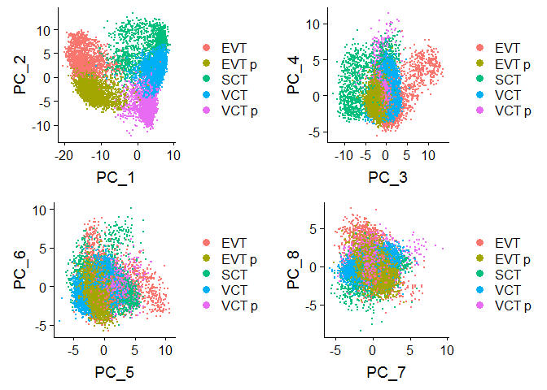
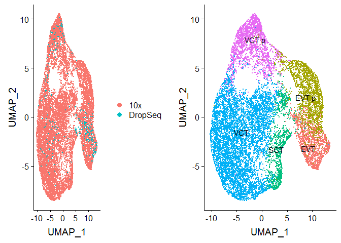
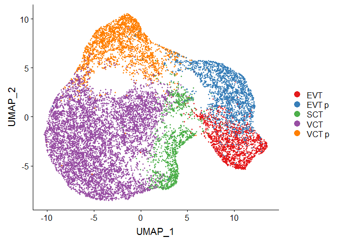
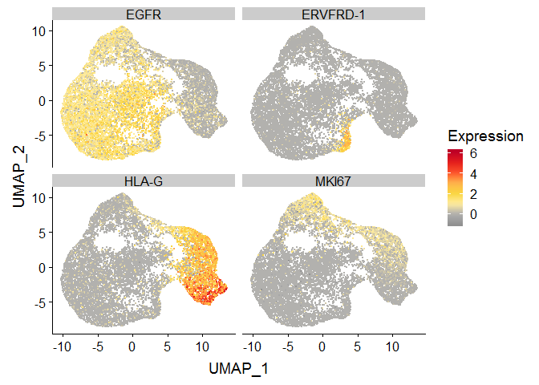

Here I subset the merged data to only trophoblast cells and perform CCA. 


# 1.0 Libraries 


```r
library(tidyr)
library(plyr) 
library(dplyr)
library(Seurat) # V3
library(ggplot2)
library(cowplot)
library(viridis)

scobj_merge <- readRDS('../../data/interim/01_scobj_merge.rds')
```

# 2.0 Trophoblast cells

## 2.1 Subset to trophoblast cells
From article:

"The trophoblast clusters (clusters 1, 9, 20, 13 and 16 from Fig. 1d) were taken from the initial analysis of all cells and merged with the enriched EPCAM+ and HLA-G+ cells. The droplet-based and Smart-seq2 datasets were integrated and clustered using the same workflow as described above. Only cells that were identified as trophoblast were considered for trajectory analysis."

So clusters 1, 9, 20, 13, and 16. And also EPCAM+ and HLA-G+ sortd cells.

Note that the legend in figure 1 is incorrect. cluster 13 should be EVT p and cluster 16 should be
EVT, based off MKI67 expression (supplementary figure)


```r
Idents(scobj_merge) <- 'final_cluster'
table(Idents(scobj_merge))
```

```
## 
##    2    3    5    6    7    8   10   11   15   16   17   21   22   24   26 
## 5661 4760 4047 3473 3006 2427 2239 2219 1810 1668 1591  938  930  777  367 
##   27   30   32   50    0    4    9   41   20   42   44   45   49   18   23 
##  359  269  220  216 7261 4357 2364  917 1261  350 1081  841  226 1372  890 
##   43    1   12   13   33   28   31   29 
##  100 7115 2188 1958  113  354  263  337
```

```r
troph <- subset(scobj_merge, subset = final_cluster %in% c(1, 9, 20, 13, 16))
troph
```

```
## An object of class Seurat 
## 63528 features across 14366 samples within 2 assays 
## Active assay: integrated (31764 features)
##  1 other assay present: RNA
##  2 dimensional reductions calculated: pca, umap
```

```r
table(Idents(troph))
```

```
## 
##   16    9   20    1   13 
## 1668 2364 1261 7115 1958
```

```r
table(troph$platform)
```

```
## 
##     10x DropSeq 
##   14083     283
```

```r
# assign cell type labels to clusters based on paper
troph$celltype <- ifelse(troph$final_cluster == 1, 'VCT',
                         ifelse(troph$final_cluster == 9, 'VCT p',
                                ifelse(troph$final_cluster == 16, 'EVT',
                                       ifelse(troph$final_cluster == 13, 'EVT p',
                                              ifelse(troph$final_cluster == 20, 'SCT', NA)))))

# recreate seurat object, otherwise I receive errors
scobj <- CreateSeuratObject(counts = troph@assays$RNA@counts, meta.data = troph@meta.data)
Idents(scobj) <- 'celltype'
```

## 2.2 CCA


```r
scobj_list <- SplitObject(object = scobj, split.by = "platform")

# find top 2000 variable features
for (i in 1:length(scobj_list)) {
  scobj_list[[i]] <- NormalizeData(object = scobj_list[[i]], verbose = T)
  scobj_list[[i]] <- FindVariableFeatures(object = scobj_list[[i]],
                                          selection.method = "vst", 
                                          nfeatures = 2000, 
                                          verbose = T)
}

# Merge datasets
reference_list <- scobj_list[c("10x", "DropSeq")]
anchors <- FindIntegrationAnchors(object.list = reference_list, dims = 1:30) # find anchors
```

```
## Computing 2000 integration features
```

```
## Scaling features for provided objects
```

```
## Finding all pairwise anchors
```

```
## Running CCA
```

```
## Merging objects
```

```
## Finding neighborhoods
```

```
## Finding anchors
```

```
## 	Found 1411 anchors
```

```
## Filtering anchors
```

```
## 	Retained 1198 anchors
```

```
## Extracting within-dataset neighbors
```

```r
troph_merge <- IntegrateData(anchorset = anchors, dims = 1:30,
                             features.to.integrate = rownames(scobj_list[[1]])) #
```

```
## Merging dataset 2 into 1
```

```
## Extracting anchors for merged samples
```

```
## Finding integration vectors
```

```
## Finding integration vector weights
```

```
## Integrating data
```

## 2.3 PCA, UMAP


```r
#scobj_merge <- ScaleData(object = scobj_merge, verbose = FALSE)
troph_merge <- ScaleData(object = troph_merge, do.scale = F, do.center = T, verbose = T)
```

```
## Centering data matrix
```

```r
troph_merge <- RunPCA(object = troph_merge, npcs = 30, verbose = FALSE)
p1 <- DimPlot(object = troph_merge, reduction = "pca", group.by = "celltype")
p2 <- DimPlot(object = troph_merge, reduction = "pca", group.by = "celltype", dims = c(3,4))
p3 <- DimPlot(object = troph_merge, reduction = "pca", group.by = "celltype", dims = c(5,6))
p4 <- DimPlot(object = troph_merge, reduction = "pca", group.by = "celltype", dims = c(7,8))
plot_grid(p1,p2,p3,p4)
```

<!-- -->

```r
troph_merge <- RunUMAP(object = troph_merge, reduction = "pca", dims = 1:5)

p1 <- DimPlot(object = troph_merge, reduction = "umap", group.by = "platform")
p2 <- DimPlot(object = troph_merge, reduction = "umap", group.by = "celltype", 
    label = TRUE, repel = TRUE) + NoLegend()
plot_grid(p1, p2)
```

<!-- -->

saveRDS(troph_merge, '../../data/interim/02_troph_merge.rds')

## 2.4 Plot figure

For UMAP projection figure


```r
pDat <- troph_merge@meta.data %>% as_tibble() %>%
  bind_cols(troph_merge@reductions$umap@cell.embeddings %>% as_tibble())

#overview
u1 <- ggplot(pDat, aes(x = UMAP_1, y = UMAP_2, col = celltype)) +
  geom_point(size = 0.7, alpha = 1) +
  scale_color_brewer(palette = 'Set1') + labs(col = '') +
  guides(col = guide_legend(override.aes = list(size = 4)))
u1
```

<!-- -->

```r
#trophoblast markers
pDat <- pDat %>% 
  bind_cols(troph_merge@assays$integrated@data[c('EGFR', 'HLA-G', 'ERVFRD-1', 'MKI67'),] %>%
              as.matrix %>% t %>% as_tibble())
pDat_melt <- pDat %>% 
  select(celltype, UMAP_1:MKI67) %>%
  gather(Gene, Expression, -celltype, -UMAP_1, -UMAP_2) %>%
  group_by(Gene) %>% 
  mutate(Expression_Z = scale(Expression))

u2 <- ggplot(pDat_melt, aes(x = UMAP_1, y = UMAP_2, col = Expression)) +
  geom_point(size = 0.2, alpha = 1) + 
  facet_wrap(~Gene, ncol = 2) +
  scale_color_gradientn(colours = c('#919191', '#AEAEAE', # greys
                                    '#ffeda0', '#F9D63E', '#feb24c', '#fc4e2a', # yellow/orange
                                    '#e31a1c', '#bd0026')) # red)
u2
```

<!-- -->

pdf('../../outs/02_UMAP_celltype.pdf', height = 6, width = 7.5)
u1
dev.off()

pdf('../../outs/02_UMAP_genes.pdf', height = 6, width = 7.5)
u2
dev.off()

# SessionInfo


```r
sessionInfo()
```

```
## R version 3.6.0 (2019-04-26)
## Platform: x86_64-w64-mingw32/x64 (64-bit)
## Running under: Windows Server x64 (build 14393)
## 
## Matrix products: default
## 
## locale:
## [1] LC_COLLATE=English_Canada.1252  LC_CTYPE=English_Canada.1252   
## [3] LC_MONETARY=English_Canada.1252 LC_NUMERIC=C                   
## [5] LC_TIME=English_Canada.1252    
## 
## attached base packages:
## [1] stats     graphics  grDevices utils     datasets  methods   base     
## 
## other attached packages:
## [1] viridis_0.5.1     viridisLite_0.3.0 cowplot_0.9.4     ggplot2_3.1.1    
## [5] Seurat_3.0.0      dplyr_0.8.0.1     plyr_1.8.4        tidyr_0.8.3      
## 
## loaded via a namespace (and not attached):
##  [1] nlme_3.1-139        tsne_0.1-3          bitops_1.0-6       
##  [4] RColorBrewer_1.1-2  httr_1.4.0          sctransform_0.2.0  
##  [7] tools_3.6.0         R6_2.4.0            irlba_2.3.3        
## [10] KernSmooth_2.23-15  lazyeval_0.2.2      colorspace_1.4-1   
## [13] npsurv_0.4-0        withr_2.1.2         tidyselect_0.2.5   
## [16] gridExtra_2.3       compiler_3.6.0      plotly_4.9.0       
## [19] labeling_0.3        caTools_1.17.1.2    scales_1.0.0       
## [22] lmtest_0.9-37       ggridges_0.5.1      pbapply_1.4-0      
## [25] stringr_1.4.0       digest_0.6.18       rmarkdown_1.12     
## [28] R.utils_2.8.0       pkgconfig_2.0.2     htmltools_0.3.6    
## [31] bibtex_0.4.2        htmlwidgets_1.3     rlang_0.3.4        
## [34] zoo_1.8-5           jsonlite_1.6        ica_1.0-2          
## [37] gtools_3.8.1        R.oo_1.22.0         magrittr_1.5       
## [40] Matrix_1.2-17       Rcpp_1.0.1          munsell_0.5.0      
## [43] ape_5.3             reticulate_1.12     R.methodsS3_1.7.1  
## [46] stringi_1.4.3       yaml_2.2.0          gbRd_0.4-11        
## [49] MASS_7.3-51.4       gplots_3.0.1.1      Rtsne_0.15         
## [52] grid_3.6.0          parallel_3.6.0      gdata_2.18.0       
## [55] listenv_0.7.0       ggrepel_0.8.0       crayon_1.3.4       
## [58] lattice_0.20-38     splines_3.6.0       SDMTools_1.1-221.1 
## [61] knitr_1.22          pillar_1.3.1        igraph_1.2.4.1     
## [64] future.apply_1.2.0  reshape2_1.4.3      codetools_0.2-16   
## [67] glue_1.3.1          evaluate_0.13       lsei_1.2-0         
## [70] metap_1.1           data.table_1.12.2   png_0.1-7          
## [73] Rdpack_0.11-0       gtable_0.3.0        RANN_2.6.1         
## [76] purrr_0.3.2         future_1.12.0       assertthat_0.2.1   
## [79] xfun_0.6            rsvd_1.0.0          survival_2.44-1.1  
## [82] tibble_2.1.1        cluster_2.0.9       globals_0.12.4     
## [85] fitdistrplus_1.0-14 ROCR_1.0-7
```
