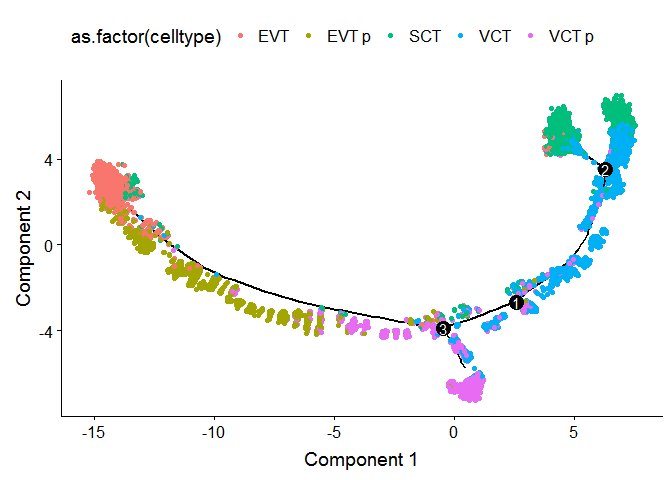
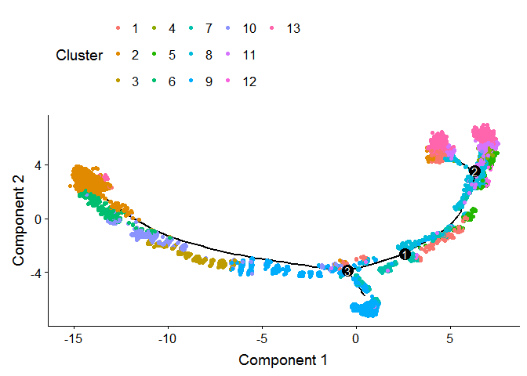
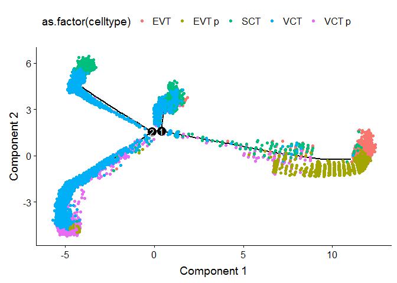

This is for analysing the scRNAseq data
# 1.0 Libraries and Data


```r
library(readxl) # read data in
library(plyr) 
library(stringr)
library(knitr);library(kableExtra) # for displaying pretty tables
```

```
## Registered S3 method overwritten by 'rvest':
##   method            from
##   read_xml.response xml2
```

```r
library(dplyr)
```

```
## 
## Attaching package: 'dplyr'
```

```
## The following object is masked from 'package:kableExtra':
## 
##     group_rows
```

```
## The following objects are masked from 'package:plyr':
## 
##     arrange, count, desc, failwith, id, mutate, rename, summarise,
##     summarize
```

```
## The following objects are masked from 'package:stats':
## 
##     filter, lag
```

```
## The following objects are masked from 'package:base':
## 
##     intersect, setdiff, setequal, union
```

```r
library(Seurat) # V3
```

```
## Registered S3 method overwritten by 'R.oo':
##   method        from       
##   throw.default R.methodsS3
```

```
## Registered S3 methods overwritten by 'ggplot2':
##   method         from 
##   [.quosures     rlang
##   c.quosures     rlang
##   print.quosures rlang
```

```r
library(readr)
library(ggplot2)
library(cowplot)
```

```
## 
## Attaching package: 'cowplot'
```

```
## The following object is masked from 'package:ggplot2':
## 
##     ggsave
```

```r
library(tidyr)
library(monocle)
```

```
## Loading required package: Matrix
```

```
## 
## Attaching package: 'Matrix'
```

```
## The following object is masked from 'package:tidyr':
## 
##     expand
```

```
## Loading required package: Biobase
```

```
## Loading required package: BiocGenerics
```

```
## Loading required package: parallel
```

```
## 
## Attaching package: 'BiocGenerics'
```

```
## The following objects are masked from 'package:parallel':
## 
##     clusterApply, clusterApplyLB, clusterCall, clusterEvalQ,
##     clusterExport, clusterMap, parApply, parCapply, parLapply,
##     parLapplyLB, parRapply, parSapply, parSapplyLB
```

```
## The following objects are masked from 'package:Matrix':
## 
##     colMeans, colSums, rowMeans, rowSums, which
```

```
## The following objects are masked from 'package:dplyr':
## 
##     combine, intersect, setdiff, union
```

```
## The following objects are masked from 'package:stats':
## 
##     IQR, mad, sd, var, xtabs
```

```
## The following objects are masked from 'package:base':
## 
##     anyDuplicated, append, as.data.frame, basename, cbind,
##     colMeans, colnames, colSums, dirname, do.call, duplicated,
##     eval, evalq, Filter, Find, get, grep, grepl, intersect,
##     is.unsorted, lapply, Map, mapply, match, mget, order, paste,
##     pmax, pmax.int, pmin, pmin.int, Position, rank, rbind, Reduce,
##     rowMeans, rownames, rowSums, sapply, setdiff, sort, table,
##     tapply, union, unique, unsplit, which, which.max, which.min
```

```
## Welcome to Bioconductor
## 
##     Vignettes contain introductory material; view with
##     'browseVignettes()'. To cite Bioconductor, see
##     'citation("Biobase")', and for packages 'citation("pkgname")'.
```

```
## Loading required package: VGAM
```

```
## Loading required package: stats4
```

```
## Loading required package: splines
```

```
## 
## Attaching package: 'VGAM'
```

```
## The following object is masked from 'package:tidyr':
## 
##     fill
```

```
## Loading required package: DDRTree
```

```
## Loading required package: irlba
```

```r
scobj_merge <- readRDS('../../data/interim/01_scobj_merge.rds')
```

# 2.0 Validate hits

First subset to trophoblast

## 2.1 Subset to Trophoblast Cells

From article:

"The trophoblast clusters (clusters 1, 9, 20, 13 and 16 from Fig. 1d) were taken from the initial analysis of all cells and merged with the enriched EPCAM+ and HLA-G+ cells. The droplet-based and Smart-seq2 datasets were integrated and clustered using the same workflow as described above. Only cells that were identified as trophoblast were considered for trajectory analysis."

So clusters 1, 9, 20, 13, and 16. And also EPCAM+ and HLA-G+ sortd cells.


```r
Idents(scobj_merge) <- 'final_cluster'
table(Idents(scobj_merge))
```

```
## 
##    2    3    5    6    7    8   10   11   15   16   17   21   22   24   26 
## 5661 4760 4047 3473 3006 2427 2239 2219 1810 1668 1591  938  930  777  367 
##   27   30   32   50    0    4    9   41   20   42   44   45   49   18   23 
##  359  269  220  216 7261 4357 2364  917 1261  350 1081  841  226 1372  890 
##   43    1   12   13   33   28   31   29 
##  100 7115 2188 1958  113  354  263  337
```

```r
troph <- subset(scobj_merge, subset = final_cluster %in% c(1, 9, 20, 13, 16))
troph
```

```
## An object of class Seurat 
## 63528 features across 14366 samples within 2 assays 
## Active assay: integrated (31764 features)
##  1 other assay present: RNA
##  2 dimensional reductions calculated: pca, umap
```

```r
table(Idents(troph))
```

```
## 
##   16    9   20    1   13 
## 1668 2364 1261 7115 1958
```

```r
table(troph$platform)
```

```
## 
##     10x DropSeq 
##   14083     283
```

```r
# assign cell type labels to clusters based on paper
troph$celltype <- ifelse(troph$final_cluster == 1, 'VCT',
                         ifelse(troph$final_cluster == 9, 'VCT p',
                                ifelse(troph$final_cluster == 16, 'EVT',
                                       ifelse(troph$final_cluster == 13, 'EVT p',
                                              ifelse(troph$final_cluster == 20, 'SCT', NA)))))
Idents(troph) <- 'celltype'
```

Recompute pca and umap coordinates on trophoblast cells:


```r
# find variable features
troph <- FindVariableFeatures(object = troph,
                              selection.method = "vst", 
                              nfeatures = 2000, 
                              verbose = T, assay = 'integrated')
```

```
## Warning in FindVariableFeatures.Assay(object = assay.data, selection.method
## = selection.method, : selection.method set to 'vst' but count slot is
## empty; will use data slot instead
```

```
## Warning in eval(predvars, data, env): NaNs produced
```

```
## Warning in hvf.info$variance.expected[not.const] <- 10^fit$fitted: number
## of items to replace is not a multiple of replacement length
```

```r
#redo umap / pca
troph <- ScaleData(object = troph, verbose = FALSE)
troph <- RunPCA(object = troph, npcs = 10, verbose = FALSE)
troph <- RunUMAP(object = troph, reduction = "pca", 
    dims = 1:10)
DimPlot(object = troph, reduction = "umap", group.by = "celltype") + 
  theme_classic() +
  ggtitle('Trophoblast cells (n = 14366)')
```

<!-- -->

then plot expression of hits

## 2.2 list of hits

### Violin plots


```r
hitlist <- read_xlsx('../../2019-03-19 currated scRNA-seq gene list.xlsx')
hitlist <- hitlist %>% gather(key = 'Geneset', value = 'Gene') %>% filter(!is.na(Gene))

# order levels to plot by
Idents(troph) <- factor(as.character(Idents(troph)), 
                        levels = c('VCT', 'VCT p', 'EVT', 'EVT p', 'SCT'))

#violin plots
VlnPlot(object = troph, features = hitlist$Gene[hitlist$Geneset=='Troph (general)'], 
        pt.size = F, ncol = 4, same.y.lims =  T) 
```

```
## Warning: Removed 1 rows containing non-finite values (stat_ydensity).
```

<!-- -->

```r
VlnPlot(object = troph, features = hitlist$Gene[hitlist$Geneset=='CTB'],
        pt.size = F, same.y.lims =  T)
```

<!-- -->

```r
VlnPlot(object = troph, features = hitlist$Gene[hitlist$Geneset=='Dist CCTB'], 
        pt.size = F, same.y.lims =  T)
```

```
## Warning: Removed 1 rows containing non-finite values (stat_ydensity).
```

<!-- -->

```r
VlnPlot(object = troph, features = hitlist$Gene[hitlist$Geneset=='Prox CCTB'],
        pt.size = F, same.y.lims =  T)
```

```
## Warning: Removed 1 rows containing non-finite values (stat_ydensity).
```

<!-- -->

```r
VlnPlot(object = troph, features = hitlist$Gene[hitlist$Geneset=='Syn Pre CTB'],
        pt.size = F, same.y.lims =  T)
```

<!-- -->

```r
VlnPlot(object = troph, features = hitlist$Gene[hitlist$Geneset=='Target High'],
        pt.size = F, same.y.lims =  T, ncol = 5)
```

<!-- -->

```r
VlnPlot(object = troph, features = hitlist$Gene[hitlist$Geneset=='Target Low'],
        pt.size = F, same.y.lims =  T, ncol = 5)
```

```
## Warning: Removed 1 rows containing non-finite values (stat_ydensity).
```

<!-- -->

### heatmap


```r
#plot average expression
average_exp <- AverageExpression(object = troph, return.seurat = T)
```

```
## Finished averaging RNA for cluster VCT
```

```
## Finished averaging RNA for cluster VCT p
```

```
## Finished averaging RNA for cluster EVT
```

```
## Finished averaging RNA for cluster EVT p
```

```
## Finished averaging RNA for cluster SCT
```

```
## Finished averaging integrated for cluster VCT
```

```
## Finished averaging integrated for cluster VCT p
```

```
## Finished averaging integrated for cluster EVT
```

```
## Finished averaging integrated for cluster EVT p
```

```
## Finished averaging integrated for cluster SCT
```

```
## Centering and scaling data matrix
```

```r
ave_exp_mat <- average_exp@assays$integrated@scale.data[,] %>% as.data.frame()

library(pheatmap)
#create annotation dataframe for genes
row_label <- as.data.frame(hitlist) 
row_label$Gene <- make.unique(row_label$Gene)
rownames(row_label) <- gsub('\\.', '-', row_label$Gene)
row_label$Geneset <- factor(row_label$Geneset, 
                            levels = c('Troph (general)', 'CTB', 'Dist CCTB', 'Prox CCTB', 
                                       'Syn Pre CTB', 'Target High', 'Target Low'))

row_label <- row_label[intersect(rownames(row_label), rownames(ave_exp_mat)),]
ave_exp_mat <- ave_exp_mat[rownames(row_label),]
pheatmap(ave_exp_mat[,c('VCT', 'VCT p', 'EVT', 'EVT p', 'SCT')], 
         cluster_rows = F, cluster_cols = F, 
         annotation_row = row_label[,'Geneset',F],
         color = RColorBrewer::brewer.pal(9, "Blues"),
         cellwidth = 15, cellheight = 15)
```

<!-- -->

# 3.0 Pseudotime

Note that because we are importing seurat merged data, we have to set the `expressionFamily` 
argument as 'gaussianff'. Then, in following functions, when possible we must specify the arguments
`norm_method` = 'none' and `pseudo_expr` = 0.

## 3.1 Import into monocle


```r
# import into monocle object
#Extract data, phenotype data, and feature data from the SeuratObject
troph_data <- as(as.matrix(troph@assays$integrated@data), 'sparseMatrix')

pd <- new('AnnotatedDataFrame', data = troph@meta.data)

fData <- data.frame(gene_short_name = row.names(troph_data), row.names = row.names(troph_data))
fd <- new('AnnotatedDataFrame', data = fData)

#Construct monocle object
monocle_cds <- newCellDataSet(troph_data,
                         phenoData = pd,
                         featureData = fd,
                         lowerDetectionLimit = 0.5,
                         expressionFamily = uninormal())

# process, not necessary unless using negbinomial 
#monocle_cds <- estimateSizeFactors(monocle_cds)
#monocle_cds <- estimateDispersions(monocle_cds) # not neessary for gaussian data

# remove genes with very low expression (noninformative)
#monocle_cds <- detectGenes(monocle_cds, min_expr = 0.1)

# sellect a minimum number of cells expressing a gene as a threshold
#fData(monocle_cds)$use_for_ordering <- 
#  fData(monocle_cds)$num_cells_expressed > 0.05 * ncol(monocle_cds)
```

## 3.2 Create trajectory

Here we try pseudotime analysis on the trophoblast cells using 3 different approaches to generate 
the trajectory.

### Ordering based on cluster DEGs

Here we are finding clusters on a reduced dimensional projection (PCA -> TSNE), then 
clustering ('density-peak'), then finding the top 1000 differentially expressed genes, then 
performing the pseudotime analysis on those genes. This is the recommended approach from the
documentation.


```r
# select number of principal components to use for pseudotime
plot_pc_variance_explained(cds = monocle_cds, max_components = 50, return_all = F, 
                           pseudo_expr = 0, norm_method = 'none') # required argumnets for gaussianff
```

<!-- -->

```r
monocle_cds <- reduceDimension(monocle_cds, max_components = 2, 
                               norm_method = 'none', pseudo_expr = 0,
                               num_dim = 10, reduction_method = 'tSNE', verbose = T)
```

```
## Remove noise by PCA ...
```

```
## Reduce dimension by tSNE ...
```

```r
# run density peak clustering on reduced projection
monocle_cds <- clusterCells(monocle_cds, rho_threshold = 2,
                         delta_threshold = 5,
                         skip_rho_sigma = T,
                         verbose = F)
```

```
## Distance cutoff calculated to 6.554119
```

```r
#  this plot can help us decide number of clusters
plot_rho_delta(monocle_cds, rho_threshold = 2, delta_threshold = 5)
```

<!-- -->

```r
plot_cell_clusters(monocle_cds, color_by = 'as.factor(Cluster)')
```

<!-- -->

```r
plot_cell_clusters(monocle_cds, color_by = 'as.factor(celltype)')
```

<!-- -->

Run DEG on clusters

~45 minutes with 24 cores


```r
# find differentially expressed genes between all clusters
clustering_DEG_genes <- differentialGeneTest(monocle_cds,
                                             fullModelFormulaStr = '~Cluster',
                                             cores = 24)
```

saveRDS(clustering_DEG_genes, '../../data/interim/clustering_DEG_genes.rds')


```r
clustering_DEG_genes <- readRDS('../../data/interim/clustering_DEG_genes.rds')

# select top 1000 differnetially expressed genes to order the cells
ordering_genes <- row.names(clustering_DEG_genes)[order(clustering_DEG_genes$qval)][1:1000]
monocle_cds <- setOrderingFilter(monocle_cds, ordering_genes = ordering_genes)
monocle_cds <- reduceDimension(monocle_cds, method = 'DDRTree', 
                               norm_method = 'none', pseudo_expr = 0)
monocle_cds <- orderCells(monocle_cds)
plot_cell_trajectory(monocle_cds, color_by = "as.factor(celltype)")
```

<!-- -->

Pretty good

### Based on top 1000 variable genes


```r
top1000variable <- troph@assays$integrated@var.features[1:1000]
monocle_cds <- setOrderingFilter(monocle_cds, ordering_genes = top1000variable)
monocle_cds <- reduceDimension(monocle_cds, method = 'DDRTree',
                               norm_method = 'none', pseudo_expr = 0)
monocle_cds <- orderCells(monocle_cds)
plot_cell_trajectory(monocle_cds, color_by = "as.factor(celltype)")
```

<!-- -->

This looks pree good. Can it be better?

### Based on top 1000 DEGs between all trophoblast subtypes


```r
# find differentially expressed genes between trophoblasts
troph_DEG_genes <- differentialGeneTest(monocle_cds,
                                        fullModelFormulaStr = '~celltype',
                                        cores = 24)
```

saveRDS(troph_DEG_genes, '../../data/interim/troph_DEG_genes.rds')


```r
troph_DEG_genes <- readRDS('../../data/interim/troph_DEG_genes.rds')

ordering_genes <- row.names(troph_DEG_genes)[order(troph_DEG_genes$qval)][1:1000]
monocle_cds <- setOrderingFilter(monocle_cds, ordering_genes = ordering_genes)
monocle_cds <- reduceDimension(monocle_cds, method = 'DDRTree', 
                               norm_method = 'none', pseudo_expr = 0)
monocle_cds <- orderCells(monocle_cds)
plot_cell_trajectory(monocle_cds, color_by = "as.factor(celltype)")
```

<!-- -->

Best so far

## 3.3 Plot gene expression along trajectory
