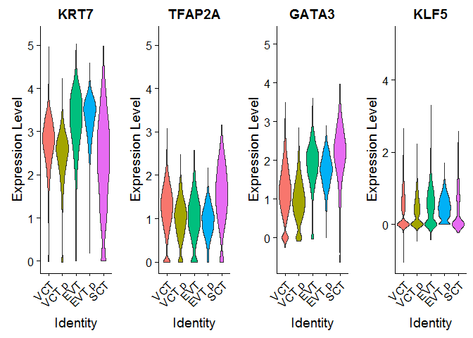
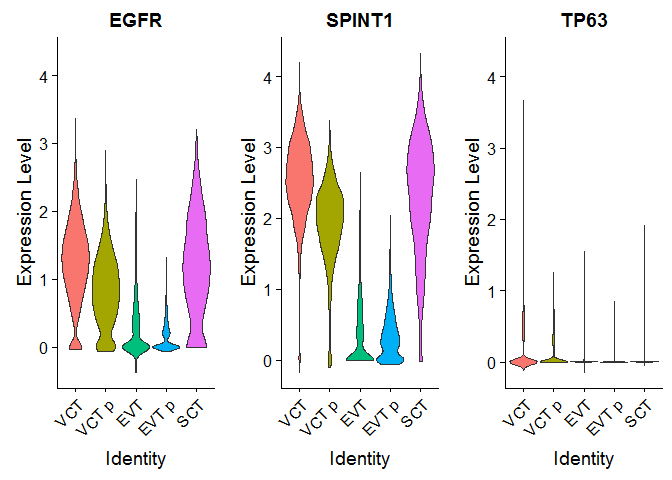
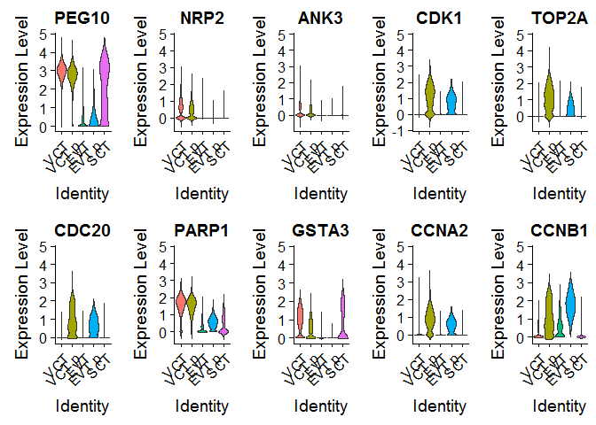
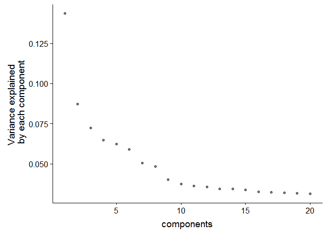

This is for analysing the scRNAseq data
# 1.0 Libraries and Data


```r
library(readxl) # read data in
```

```
## Warning: package 'readxl' was built under R version 3.5.2
```

```r
library(plyr) 
library(stringr)
```

```
## Warning: package 'stringr' was built under R version 3.5.2
```

```r
library(knitr);library(kableExtra) # for displaying pretty tables
```

```
## Warning: package 'knitr' was built under R version 3.5.2
```

```
## Warning: package 'kableExtra' was built under R version 3.5.2
```

```r
library(dplyr)
```

```
## 
## Attaching package: 'dplyr'
```

```
## The following objects are masked from 'package:plyr':
## 
##     arrange, count, desc, failwith, id, mutate, rename, summarise,
##     summarize
```

```
## The following objects are masked from 'package:stats':
## 
##     filter, lag
```

```
## The following objects are masked from 'package:base':
## 
##     intersect, setdiff, setequal, union
```

```r
library(Seurat) # V3
library(readr)
```

```
## Warning: package 'readr' was built under R version 3.5.3
```

```r
library(ggplot2)
library(cowplot)
```

```
## Warning: package 'cowplot' was built under R version 3.5.2
```

```
## 
## Attaching package: 'cowplot'
```

```
## The following object is masked from 'package:ggplot2':
## 
##     ggsave
```

```r
library(tidyr)

scobj_merge <- readRDS('../../data/interim/01_scobj_merge.rds')
```

# 2.0 Validate hits

First subset to trophoblast

## 2.1 Subset to Trophoblast Cells

From article:

"The trophoblast clusters (clusters 1, 9, 20, 13 and 16 from Fig. 1d) were taken from the initial analysis of all cells and merged with the enriched EPCAM+ and HLA-G+ cells. The droplet-based and Smart-seq2 datasets were integrated and clustered using the same workflow as described above. Only cells that were identified as trophoblast were considered for trajectory analysis."

So clusters 1, 9, 20, 13, and 16. And also EPCAM+ and HLA-G+ sortd cells.


```r
Idents(scobj_merge) <- 'final_cluster'
table(Idents(scobj_merge))
```

```
## 
##    2    3    5    6    7    8   10   11   15   16   17   21   22   24   26 
## 5661 4760 4047 3473 3006 2427 2239 2219 1810 1668 1591  938  930  777  367 
##   27   30   32   50    0    4    9   41   20   42   44   45   49   18   23 
##  359  269  220  216 7261 4357 2364  917 1261  350 1081  841  226 1372  890 
##   43    1   12   13   33   28   31   29 
##  100 7115 2188 1958  113  354  263  337
```

```r
troph <- subset(scobj_merge, subset = final_cluster %in% c(1, 9, 20, 13, 16))
troph
```

```
## An object of class Seurat 
## 63528 features across 14366 samples within 2 assays 
## Active assay: integrated (31764 features)
##  2 dimensional reductions calculated: pca, umap
```

```r
table(Idents(troph))
```

```
## 
##   16    9   20    1   13 
## 1668 2364 1261 7115 1958
```

```r
table(troph$platform)
```

```
## 
##     10x DropSeq 
##   14083     283
```

```r
# assign cell type labels to clusters based on paper
troph$celltype <- ifelse(troph$final_cluster == 1, 'VCT',
                         ifelse(troph$final_cluster == 9, 'VCT p',
                                ifelse(troph$final_cluster == 13, 'EVT',
                                       ifelse(troph$final_cluster == 16, 'EVT p',
                                              ifelse(troph$final_cluster == 20, 'SCT', NA)))))
Idents(troph) <- 'celltype'
```

Recompute pca and umap coordinates on trophoblast cells:


```r
#redo umap / pca
troph <- ScaleData(object = troph, verbose = FALSE)
troph <- RunPCA(object = troph, npcs = 10, verbose = FALSE)
troph <- RunUMAP(object = troph, reduction = "pca", 
    dims = 1:10)
DimPlot(object = troph, reduction = "umap", group.by = "celltype") + 
  theme_classic() +
  ggtitle('Trophoblast cells (n = 14366)')
```

<!-- -->

then plot expression of hits

## 2.2 list of hits

### Violin plots


```r
hitlist <- read_xlsx('../../2019-03-19 currated scRNA-seq gene list.xlsx')
hitlist <- hitlist %>% gather(key = 'Geneset', value = 'Gene') %>% filter(!is.na(Gene))

# order levels to plot by
Idents(troph) <- factor(as.character(Idents(troph)), 
                        levels = c('VCT', 'VCT p', 'EVT', 'EVT p', 'SCT'))

#violin plots
VlnPlot(object = troph, features = hitlist$Gene[hitlist$Geneset=='Troph (general)'], 
        pt.size = F, ncol = 4, same.y.lims =  T) 
```

```
## Warning: Removed 1 rows containing non-finite values (stat_ydensity).
```

<!-- -->

```r
VlnPlot(object = troph, features = hitlist$Gene[hitlist$Geneset=='CTB'],
        pt.size = F, same.y.lims =  T)
```

<!-- -->

```r
VlnPlot(object = troph, features = hitlist$Gene[hitlist$Geneset=='Dist CCTB'], 
        pt.size = F, same.y.lims =  T)
```

```
## Warning: Removed 1 rows containing non-finite values (stat_ydensity).
```

<!-- -->

```r
VlnPlot(object = troph, features = hitlist$Gene[hitlist$Geneset=='Prox CCTB'],
        pt.size = F, same.y.lims =  T)
```

```
## Warning: Removed 1 rows containing non-finite values (stat_ydensity).
```

<!-- -->

```r
VlnPlot(object = troph, features = hitlist$Gene[hitlist$Geneset=='Syn Pre CTB'],
        pt.size = F, same.y.lims =  T)
```

<!-- -->

```r
VlnPlot(object = troph, features = hitlist$Gene[hitlist$Geneset=='Target High'],
        pt.size = F, same.y.lims =  T, ncol = 5)
```

<!-- -->

```r
VlnPlot(object = troph, features = hitlist$Gene[hitlist$Geneset=='Target Low'],
        pt.size = F, same.y.lims =  T, ncol = 5)
```

```
## Warning: Removed 1 rows containing non-finite values (stat_ydensity).
```

<!-- -->

### heatmap


```r
#plot average expression
average_exp <- AverageExpression(object = troph, return.seurat = T)
```

```
## Finished averaging integrated for cluster VCT
```

```
## Finished averaging integrated for cluster VCT p
```

```
## Finished averaging integrated for cluster EVT
```

```
## Finished averaging integrated for cluster EVT p
```

```
## Finished averaging integrated for cluster SCT
```

```
## Scaling data matrix
```

```r
ave_exp_mat <- average_exp@assays$integrated@scale.data[,] %>% as.data.frame()

library(pheatmap)
```

```
## Warning: package 'pheatmap' was built under R version 3.5.2
```

```r
#create annotation dataframe for genes
row_label <- as.data.frame(hitlist) 
row_label$Gene <- make.unique(row_label$Gene)
rownames(row_label) <- gsub('\\.', '-', row_label$Gene)
row_label$Geneset <- factor(row_label$Geneset, 
                            levels = c('Troph (general)', 'CTB', 'Dist CCTB', 'Prox CCTB', 
                                       'Syn Pre CTB', 'Target High', 'Target Low'))

row_label <- row_label[intersect(rownames(row_label), rownames(ave_exp_mat)),]
ave_exp_mat <- ave_exp_mat[rownames(row_label),]
pheatmap(ave_exp_mat[,c('VCT', 'VCT p', 'EVT', 'EVT p', 'SCT')], 
         cluster_rows = F, cluster_cols = F, 
         annotation_row = row_label[,'Geneset',F],
         color = RColorBrewer::brewer.pal(9, "Blues"),
         cellwidth = 15, cellheight = 15)
```

<!-- -->
